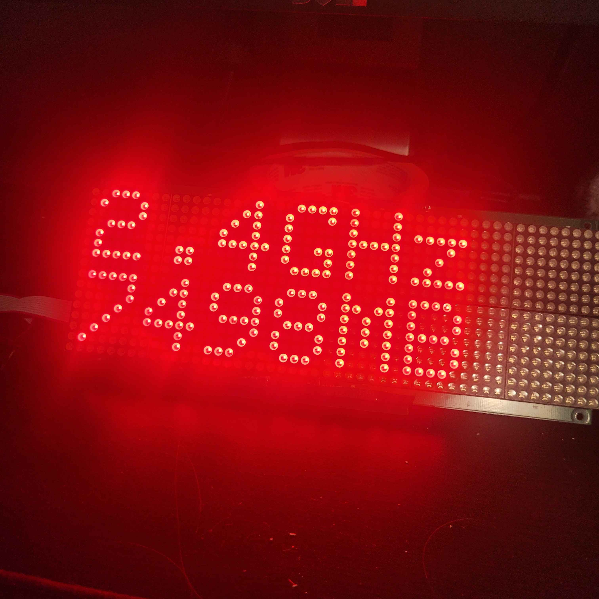

<!-- https://github.com/yarnlet/resource-monitor-arduino -->

    <h1> resource-monitor-arduino </h1>
    <h3> Introduction </h3>
    
 This project allows you to use two Adafruit HT1632 dot matrix displays in order to show you your system resources. 
 
    
    <h3> Usage </h3>
    
 Make sure you have:  
    - Python3 (Tested on v3.12.3) - <a href="https://www.python.org/downloads/"> Download </a> 
    - Arduino IDE (Tested on v2.1) - <a href="https://www.arduino.cc/en/software/"> Download </a> 
     
    1. Rename the root folder to 'resource-monitor-arduino' if applicable  
    2. Run `pip install -r requirements.txt` in the root directory  
    3. Open 'resource-monitor-arduino.ino' in Arduino IDE  
    4. Select the correct board / com port and upload the sketch  
    5. Edit 'monitorSerialLink.py' and replace "COMPORTHERE" with the Arduino's port (COM#)  
     
    <b> MAKE SURE TO FOLLOW THE ADAFRUIT WIRING GUIDE FOR THE ARDUINO! </b> 
    <a> https://learn.adafruit.com/16x24-led-matrix/multiple-displays </a>

